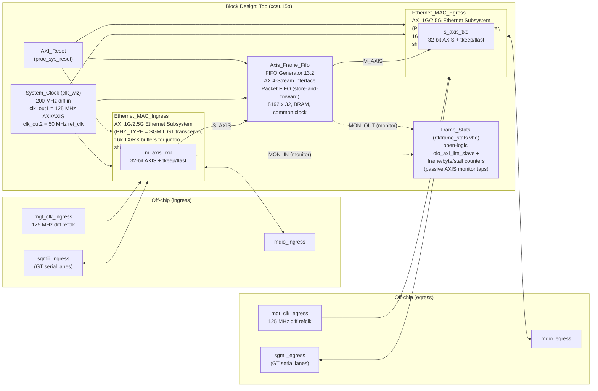
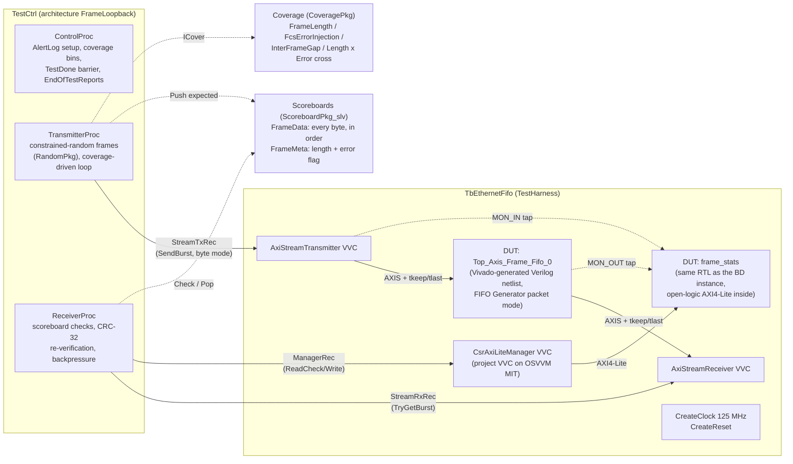
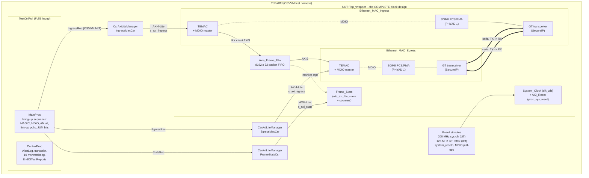

# OSVVM Ethernet Loopback Demonstration

A complete, working demonstration of the **OSVVM verification methodology**
([github.com/OSVVM](https://github.com/OSVVM)) applied to a Vivado
block-design datapath, simulated on both Questa and the Vivado simulator.

This simulation methodology is ideal for bringing **UVM** capabilities to a
VHDL methodology. An option is to convert all verification over to **SystemVerilog**
and leverage the industry-standard UVM features that have been used for years.
This is a call that can be made later. For now, this project confirms that
integrating OS-VVM with Vivado simulator is doable, and with Questa (or Riviera, etc.)
is ideal.

Please note that this Readme is *comprehensive* by design. I tried to make
it self-stranding, so if you need something to build, run, paths adjusted, etc.
it's *likely* in here, so please search!

The synthesizable design is an Ethernet frame bridge: two AMD/Xilinx
**AXI 1G/2.5G Ethernet Subsystems** (SGMII over GT transceivers) joined by an
**AXI4-Stream FIFO Generator** in packet mode, with jumbo-frame support
enabled end to end. Several design decisions were drawn from prior work,
such as the 125 MHz clock, etc. This was to get a design simulating faster
out the door, bout shouldn't really matter much for this demonstration.

There are **two simulation modes**, each available on both simulators:

* **Datapath mode** (the default, and the per-commit workhorse): the OSVVM
  testbench drives real Ethernet frames (genuine CRC-32 FCS) from 64-byte
  minimum to **9018-byte jumbo** through the frame-FIFO datapath with
  **constrained-random stimulus**, **self-checking scoreboards**, and
  **functional coverage** that objectively defines when the test is *done*
  (§3).
* **Full block-design mode** (`--full_sim`): the **entire BD** — both
  Ethernet subsystems with the **GT transceivers as SecureIP models** —
  runs a bring-up test that takes the SGMII links to LINK UP over
  cross-looped serial lanes and programs the MACs over AXI4-Lite (§5.4).

| Item | Value |
|---|---|
| Target part | `xcau15p-ffvb676-2-e` (Alinx AXAU15, Artix UltraScale+) |
| Vivado | 2026.1 (batch or TCL-console build, synthesis-only) |
| Simulators | Questa 2025.1 (`sim/run_sim.sh`) and Vivado XSim (`sim/run_sim.tcl`) |
| OSVVM | OsvvmLibraries 2026.05 (`2494959`, recursive submodules) |
| open-logic | 4.6.0 (`ecca8af`) — `olo_axi_lite_slave` inside the Frame_Stats block |
| Frame sizes | 64 B – 9018 B (9000-byte-payload jumbo), MAC jumbo support enabled |
| Questa result | **PASSED** — 403 frames, 945,639 affirmations, 100% coverage incl. jumbo bins, CSR counters verified, ~15 s turnaround |
| XSim result | **PASSED** — 403 frames, 902,859 affirmations, 100% coverage incl. jumbo bins, CSR counters verified, ~87 s turnaround (§5.3) |
| Full-BD sim (`--full_sim`) | **PASSED** on both simulators — entire BD incl. GT SecureIP, SGMII links up over serial loopback, 310 affirmations (§5.4) |

The design targets the Alinx AXAU15 board's FPGA part but is intended for
**behavioral simulation + synthesis only** — no pinout, no implementation, no
bitstream.

## Table of Contents

1. [Directory Structure](#1-directory-structure)
2. [The Synthesizable Design](#2-the-synthesizable-design)
   - [2.1 Block Diagram](#21-block-diagram)
   - [2.2 Data Path](#22-data-path)
   - [2.3 Deliberately Unconnected Interfaces](#23-deliberately-unconnected-interfaces)
   - [2.4 Frame_Stats — Register Observability](#24-frame_stats--register-observability-built-on-open-logic)
   - [2.5 Reset Handling](#25-reset-handling)
   - [2.6 Build Script](#26-build-script)
3. [The Testbench](#3-the-testbench)
   - [3.1 Verification Boundary](#31-verification-boundary)
   - [3.2 Testbench Architecture](#32-testbench-architecture)
   - [3.3 What a Test Run Does](#33-what-a-test-run-does)
   - [3.4 Result](#34-result)
   - [3.5 Simulation Artifacts](#35-simulation-artifacts)
4. [OSVVM Usage and Advantages](#4-osvvm-usage-and-advantages)
   - [4.1 What OSVVM Buys For This Project](#41-what-osvvm-buys-for-this-project)
   - [4.2 Feature-by-Feature](#42-feature-by-feature)
5. [Running the Simulation](#5-running-the-simulation)
   - [5.1 Questa (primary flow)](#51-questa-primary-flow)
   - [5.2 Vivado Simulator (XSim)](#52-vivado-simulator-xsim)
   - [5.3 Runtime Benchmark — Questa vs. Vivado Simulator](#53-runtime-benchmark--questa-vs-vivado-simulator)
   - [5.4 Full Block-Design Simulation (--full_sim)](#54-full-block-design-simulation---full_sim)
6. [Integrating OSVVM with Vivado and Questa — Field Notes](#6-integrating-osvvm-with-vivado-and-questa--field-notes)
7. [Issues Encountered and Overcome](#7-issues-encountered-and-overcome)
8. [Reproducing From Scratch](#8-reproducing-from-scratch)

---

## 1. Directory Structure

```
OS-VVM_Test/
├── build_all.tcl               Vivado project/BD/synthesis build script
├── README.md                   This file
├── .gitignore                  Ignores deps/ + all generated Vivado/sim output
├── deps/
│   ├── OsvvmLibraries/         OSVVM submodule (2026.05 @ 2494959, recursive)
│   └── open-logic/             open-logic submodule (4.6.0 @ ecca8af)
├── rtl/
│   └── frame_stats.vhd         AXI4-Lite frame statistics (uses open-logic)
├── sim/
│   ├── run_sim.sh              Questa launcher (GUI/batch/detailed/full_sim/clean)
│   ├── run_sim.tcl             Vivado simulator (XSim) launcher - same test
│   ├── compile.do              OSVVM libs + Xilinx models + TB compilation
│   ├── simulate.do             Elaboration, wave setup, run
│   ├── full_sim_export.tcl     INTERNAL: Vivado sim-script export, shared
│   │                           dependency of both --full_sim flows (5.4)
│   └── tb/
│       ├── EthFramePkg.vhd     Ethernet CRC-32 (FCS) + frame helpers
│       ├── CsrAxiLiteManager.vhd  Project AXI4-Lite manager VVC (OSVVM MIT)
│       ├── TestCtrl_e.vhd      OSVVM test-sequencer entity
│       ├── TbEthernetFifo.vhd  Test harness (VVCs + DUTs)
│       ├── TestCtrl_FrameLoopback.vhd   The datapath test case
│       ├── TestCtrlFull_e.vhd  Full-BD test-sequencer entity (--full_sim)
│       ├── TbFullBd.vhd        Full-BD harness (GT SecureIP, serial loopback)
│       └── TestCtrl_FullBringup.vhd     The full-BD bring-up test case
└── OSVVM_Ethernet_Sim.*        Vivado project outputs (generated)
```

Dependencies are **git submodules** (pinned pointer commits, contents not
vendored):

```bash
# When cloning this repo:
git clone --recurse-submodules <this-repo-url>
# Or in an existing checkout:
git submodule update --init --recursive
```

(The `--recursive`/`--recurse-submodules` matters: OsvvmLibraries has
submodules of its own.)

`open-logic` contributes the AXI4-Lite protocol engine
(`olo_axi_lite_slave`) inside the project's `Frame_Stats` block (§2.4). It
was also evaluated for the reset path — see §2.5 for that decision record.

Only the scripts, testbench sources, README and `.gitignore` are meant for
version control; `deps/` and every Vivado/simulator output are ignored and
regenerated (`git clone` + `build_all.tcl` + a simulation run rebuild the
whole tree from scratch).

---

## 2. The Synthesizable Design

### 2.1 Block Diagram

The top level is a Vivado block design named `Top`, wrapped by the standard
Vivado auto-generated **Verilog** wrapper (`Top_wrapper.v`, created with
`make_wrapper -top`, same flow as the other projects in this workspace).



Also at the BD boundary: `s_axi_ingress` / `s_axi_egress` (AXI4-Lite
management ports for each MAC) and `s_axi_stats` (the Frame_Stats register
port), all associated with the exported `axi_clk_125MHz`, plus
`system_resetn`, `clocks_locked`, and `sys_clk_in` (200 MHz differential).

### 2.2 Data Path

Frames enter on the **ingress** SGMII serial lanes, are deserialized and
PCS/PMA-decoded (`gig_ethernet_pcs_pma` 17.0 inside the subsystem, SGMII used
internally, GT transceiver for off-chip I/O), pass through the TEMAC, and
emerge on the MAC's 32-bit AXI4-Stream RX client interface (`m_axis_rxd`,
with `tkeep` for the partial final word and `tlast` framing).

That stream feeds the **FIFO Generator** configured with an embedded
AXI4-Stream interface in **Packet FIFO** (store-and-forward) mode: a frame is
only presented on `M_AXIS` after its `tlast` has been written. That is the
correct bridging discipline between two MACs — the egress MAC must never be
starved mid-frame, since an underrun would corrupt the frame on the wire.
Depth is 8192 × 32 bits (32 KB) in block RAM, common clock on both sides
(single 125 MHz AXIS domain). Packet mode requires at least one complete
frame to fit in the FIFO: a maximum 9018-byte jumbo frame occupies 2255
words, so the FIFO store-and-forwards three complete jumbo frames (or dozens
of standard ones).

**Jumbo frame support** is a two-part story in the AXI Ethernet subsystem:

* **Build time** (done here): the TEMAC's internal TX/RX frame buffers must
  hold a complete maximum-size frame, so `CONFIG.TXMEM`/`CONFIG.RXMEM` are
  raised from the 4k default to **16k** on both MACs.
* **Run time** (host software's job): jumbo acceptance/transmission is
  enabled by the TEMAC's `JUM` bits — Receiver Configuration Word 1 bit 30
  and Transmitter Configuration bit 30 — written through the `s_axi_ingress`
  / `s_axi_egress` management ports. The datapath testbench (§3) does not
  touch them (the MACs sit outside its verification boundary), but the
  full-BD bring-up test (§5.4) **sets and reads back both bits on both
  MACs over AXI4-Lite** — so the runtime half of the jumbo story is
  exercised in simulation too, exactly as bring-up software would do it.

The FIFO's `M_AXIS` drives the **egress** MAC's TX client interface
(`s_axis_txd`), which transmits the frame out of the egress SGMII serial
lanes. All connectivity between the three blocks is AXI4-Stream.

### 2.3 Deliberately Unconnected Interfaces

The demo is a single-direction bridge, and the checksum-offload sideband
streams are out of scope for the AXIS datapath verification target:

* `Ethernet_MAC_Ingress/m_axis_rxs` — RX status stream (offload metadata)
* `Ethernet_MAC_Egress/s_axis_txc` — TX control stream (offload directives)
* The reverse direction (`Ingress/s_axis_txd|txc`, `Egress/m_axis_rxd|rxs`)

In a production bidirectional bridge you would mirror the FIFO for the other
direction and either drive `s_axis_txc` with proper control words or use the
full-checksum-offload configuration; for this synthesis-plus-simulation demo
they are left unconnected (Vivado ties the inputs off). One knock-on effect
worth knowing: because the client AXIS interfaces are internal to the BD,
the full-BD simulation (§5.4) has no way to inject frames — which is why it
is a bring-up/integration test rather than a traffic test.

### 2.4 Frame_Stats — Register Observability (built on open-logic)

`rtl/frame_stats.vhd` is the project-authored control-plane block: it counts
what the datapath actually does and exposes it over AXI4-Lite. The AXI4-Lite
protocol engine inside it is **open-logic's `olo_axi_lite_slave`** — a clean,
fully hand-shaken register-file kernel with a read-timeout guard — so the
project RTL is only the counters and the register bank on its simple `Rb_*`
user interface.

The block sits in the BD as an RTL **module reference** with two
**monitor-mode** AXI4-Stream interfaces (declared via `X_INTERFACE_MODE
"monitor"` attributes in the VHDL) tapped onto the existing FIFO links —
purely passive, only `TVALID/TREADY/TKEEP/TLAST` are observed:

* `MON_IN`  — ingress MAC `m_axis_rxd` → FIFO `S_AXIS`
* `MON_OUT` — FIFO `M_AXIS` → egress MAC `s_axis_txd`

Register map (32-bit registers, byte addresses, on the external
`s_axi_stats` port):

| Addr | Register | Access | Contents |
|---|---|---|---|
| 0x00 | MAGIC | RO | `0x46535431` ("FST1") |
| 0x04 | CTRL | WO | bit 0: write 1 to clear all counters |
| 0x08 | FRAMES_IN | RO | TLAST beats accepted on MON_IN |
| 0x0C | FRAMES_OUT | RO | TLAST beats accepted on MON_OUT |
| 0x10 | BYTES_IN | RO | Σ set TKEEP bits accepted on MON_IN |
| 0x14 | BYTES_OUT | RO | Σ set TKEEP bits accepted on MON_OUT |
| 0x18 | STALL_IN | RO | Cycles TVALID·¬TREADY on MON_IN |
| 0x1C | STALL_OUT | RO | Cycles TVALID·¬TREADY on MON_OUT |

The same RTL instance is verified in the testbench through an AXI4-Lite
manager VVC driven with OSVVM's standard address-bus transactions (§3),
closing the loop between stream traffic and register observability.

### 2.5 Reset Handling

The 125 MHz domain reset comes from the Xilinx `proc_sys_reset`
(`AXI_Reset`): asynchronous assertion, synchronous de-assertion, sequenced
interconnect/peripheral resets, and `dcm_locked` gating so nothing leaves
reset until the PLL is stable.

### 2.6 Build Script

`build_all.tcl` follows the same structure as the other `build_all.tcl`
scripts in this workspace (global config variables, `resolve_ip_vlnv` for
IP-version drift across Vivado releases, one `build_all` proc):

```bash
# Batch mode (build_all runs automatically):
cd /media/fpgadev/Dev_Tools/Work/OS-VVM_Test
vivado -mode batch -source build_all.tcl
```

```tcl
# Or from the Vivado TCL console:
cd /media/fpgadev/Dev_Tools/Work/OS-VVM_Test
source build_all.tcl
build_all
```

Batch detection uses `$::rdi::mode`, so the same file serves both flows. The
script creates the project, builds and validates the BD, generates the
Verilog wrapper and all IP output products, exports the IP user files (which
is what the Questa flow consumes), launches synthesis (top + all
out-of-context IP runs) and **stops after synthesis succeeds** — by design
there is no implementation step. Synthesis completes with 0 errors; the
TEMAC/PCS-PMA sub-cores all produce checkpoints in their OOC runs.

**Project fileset hygiene** (what the Vivado GUI shows):

* **Design Sources** — the top is pinned explicitly to `Top_wrapper`, so
  the hierarchy reads `Top_wrapper → Top.bd → {MACs, FIFO, Frame_Stats,
  clocking, reset}`. Without the explicit pin, Vivado's auto top detection
  promoted `frame_stats` — a plain project source that the BD *also*
  consumes as a module reference — to a parallel top.
* **Simulation Sources** — a dedicated simset `sim_tb` (the active one)
  holds all eight OSVVM testbench files with its top set to `TbFullBd`, so
  the GUI shows the real verification hierarchy: `TbFullBd` → the three
  `CsrAxiLiteManager` VVCs, `TestCtrlFull`, and the complete `Top_wrapper`
  UUT beneath it (120 files deep). These files are *registered for
  browsing only* — OSVVM lives outside the project, so Vivado never
  compiles them; the sim/ launchers do. `sim_1` stays DUT-only because
  `full_sim_export.tcl` uses it to generate DUT-only compile scripts
  (§5.4), switching the active simset over and back as it runs.

---

## 3. The Testbench

This section describes the **datapath testbench** — the coverage-driven
constrained-random test that is the project's primary verification vehicle.
The second testbench, the full-BD bring-up test behind `--full_sim`, is
described in §5.4; the boundary discussion below explains why the two exist
and how they divide the work.

### 3.1 Verification Boundary

The tasking calls for behavioral simulation of the design with AxiStream
VVCs driving and checking *real frames*. Simulating the entire BD through
both MACs would require the GT SecureIP models, PCS/PMA autonegotiation
(milliseconds of simulated link bring-up per run), MDIO/AXI-Lite MAC
configuration, and TX control-word generation — none of which exercises the
project-authored logic any harder, because the MAC subsystems are AMD-verified
IP. The part of this design that is *ours* is the AXIS frame datapath and its
FIFO bridging discipline.

So the testbench instantiates **the exact FIFO Generator instance generated
from the block design** (`Top_Axis_Frame_Fifo_0`, the Vivado simulation
netlist — not a re-parameterized lookalike) plus **the same
`frame_stats` RTL** that sits in the BD, and uses OSVVM VVCs to play the
roles of the surrounding blocks:

* `AxiStreamTransmitter` ⇒ ingress MAC `m_axis_rxd` (delivers received frames)
* `AxiStreamReceiver` ⇒ egress MAC `s_axis_txd` (drains frames for transmit)
* `CsrAxiLiteManager` ⇒ the host CPU on the Frame_Stats `s_axi_stats` port
  (a compact project-authored VVC on OSVVM Model Independent Transactions —
  the test drives it with the standard `Write`/`Read`/`ReadCheck` verbs; see
  §7.10 for why the stock `Axi4LiteManager` could not be used on XSim)

This is the boundary a verification team would actually choose, and it keeps
the simulation fast enough (seconds) to run on every commit.

The excluded region does not go unsimulated, though: the `--full_sim` mode
(§5.4) runs the **whole BD** — GT SecureIP, PCS/PMA, TEMACs and all — as a
bring-up/integration test (links up over serial loopback, MACs programmed
over AXI4-Lite). The split is deliberate: exhaustive frame-level
verification where the project-authored logic lives, at per-commit speed;
full-stack integration proof on demand.

Block by block (names as instantiated by `build_all.tcl`), here is exactly
what each mode simulates:

| BD block | Datapath test (default) | Full BD (`--full_sim`) |
|---|---|---|
| `Axis_Frame_Fifo` | **Simulated — the exact BD instance** (Vivado-generated netlist `Top_Axis_Frame_Fifo_0.v` + fifo_generator behavioral model), under maximum frame stress | Simulated, but **functionally idle** — the client AXIS interfaces are internal to the BD (§2.3), so no frames flow |
| `Frame_Stats` | **Simulated — source-identical RTL** (`rtl/frame_stats.vhd` + open-logic, the same sources the BD module reference consumes), counters cross-checked against ~1M-check traffic | Simulated (the BD's own instance), exercised over `s_axi_stats` (MAGIC, register dump, counters-zero) |
| `Ethernet_MAC_Ingress` | Not simulated — `AxiStreamTransmitter` VVC stands in at its `m_axis_rxd` client interface | **Simulated in full**: Ethernet buffer, TEMAC (registers + MDIO over `s_axi_ingress`), SGMII PCS/PMA, GT SecureIP (link up over serial loopback) |
| `Ethernet_MAC_Egress` | Not simulated — `AxiStreamReceiver` VVC stands in at its `s_axis_txd` client interface | **Simulated in full**: same hierarchy, via `s_axi_egress` and the other serial lane pair |
| `System_Clock` | Not simulated — OSVVM `CreateClock` (125 MHz) replaces it | Simulated (clk_wiz MMCM model, 200 MHz in → 125 MHz + 50 MHz `ref_clk`; the test waits on its `clocks_locked`) |
| `AXI_Reset` | Not simulated — OSVVM `CreateReset` replaces it | Simulated (proc_sys_reset, sequencing all BD resets) |
| `signal_detect_const` | Absent (only exists to feed the MACs) | Simulated (xlconstant tie-off) |

The two rows the datapath test simulates are precisely the blocks the
project **authored or configured**; `--full_sim` covers all seven at
bring-up intensity. Between the two modes, every block in the BD is
simulated — and each is stressed by the mode best suited to it.

### 3.2 Testbench Architecture



### 3.3 What a Test Run Does

**Stimulus (TransmitterProc)** — every frame is constrained-random via
OSVVM `RandomPkg`:

* **Frame length**: `DistInt` picks a weighted size bin (64 exactly, 65–127,
  128–255, 256–511, 512–1023, 1024–1517, 1518 exactly, 1519–4095, 4096–8191,
  8192–9017, **9018 exactly** — the 9000-byte-payload jumbo maximum), then
  `RandInt` uniformly inside the bin. Corner sizes are their own bins so the
  minimum, the standard maximum, and the jumbo maximum *must* all occur.
  About a third of the weight lands in jumbo territory.
* **Content is a real Ethernet frame**: locally-administered DA/SA, random
  payload, and a **genuine CRC-32 FCS** computed by `EthFramePkg` (standard
  reflected 802.3 polynomial). The Type/Length field is realistic too: an
  802.3 length field for payloads ≤ 1500 bytes, and the IEEE local
  experimental EtherType `0x88B5` for jumbo payloads (a length field cannot
  represent them, exactly as on real wire).
* **Error injection**: 20% of frames get an FCS byte XOR-corrupted with a
  random non-zero value.
* **Inter-frame gap**: weighted random — back-to-back (0 idle cycles) is a
  deliberate bin, plus short/medium/long gaps up to 63 cycles.
* Frames go to the VVC with `SendBurst` in byte-burst mode; the VVC handles
  word packing, `tkeep` for the partial last word, and `tlast`.

**Checking (ReceiverProc)** — nothing is eyeballed:

* Every transmitted byte was pushed to the `FrameData` scoreboard; every
  received byte is `Check`ed in order — content *and* ordering proven.
* Frame length is affirmed against the `FrameMeta` metadata entry.
* The receiver **independently recomputes CRC-32** over each received frame
  and cross-checks the result against the injection flag: clean frames must
  pass FCS, corrupted frames must fail it. This proves the FIFO is honestly
  transparent — it neither corrupts good frames nor heals bad ones.
* READY backpressure is re-randomized every 8 frames through the VVC's
  `RECEIVE_READY_DELAY_CYCLES` option — flow-control stress without a single
  line of signal wiggling.
* **Register observability is cross-checked against stream truth** through
  the AXI4-Lite manager VVC: the MAGIC register is verified before traffic;
  after the drain, `FRAMES_IN/OUT` and `BYTES_IN/OUT` must equal the
  testbench's own frame and byte accounting, `STALL_OUT` must be non-zero
  (proof the randomized backpressure really happened), and the CTRL clear
  function is exercised and re-read as zero.

**Completion is objective** — the transmit loop runs *until functional
coverage closes*:

```vhdl
while not (IsCovered(CovLen) and IsCovered(CovErr)
           and IsCovered(CovGap) and IsCovered(CovLenXErr)) loop
```

When every bin (including the size-bin × error cross — every frame-size bin
seen both clean and corrupted) reaches its `AtLeast` goal, the test is done.
A 2000-frame safety cap raises an `Alert` (test FAILs) if coverage ever
stops closing — "we ran the cases we thought of" is replaced by a
machine-checked completion criterion.

### 3.4 Result

```
%% WriteBin: FrameLength
%% Len_64_min      Bin:(64)           Count = 4    AtLeast = 3
%% Len_65_127      Bin:(65 to 127)    Count = 50   AtLeast = 10
%% Len_128_255     Bin:(128 to 255)   Count = 50   AtLeast = 10
%% Len_256_511     Bin:(256 to 511)   Count = 46   AtLeast = 10
%% Len_512_1023    Bin:(512 to 1023)  Count = 40   AtLeast = 10
%% Len_1024_1517   Bin:(1024 to 1517) Count = 54   AtLeast = 10
%% Len_1518_std    Bin:(1518)         Count = 19   AtLeast = 3
%% Len_1519_4095   Bin:(1519 to 4095) Count = 60   AtLeast = 8
%% Len_4096_8191   Bin:(4096 to 8191) Count = 36   AtLeast = 8
%% Len_8192_9017   Bin:(8192 to 9017) Count = 25   AtLeast = 8
%% Len_9018_jumbo  Bin:(9018)         Count = 19   AtLeast = 3
%% WriteBin: FcsErrorInjection
%% Clean           Bin:(0)            Count = 339  AtLeast = 40
%% FcsError        Bin:(1)            Count = 64   AtLeast = 8
%% WriteBin: InterFrameGap
%% BackToBack      Bin:(0)            Count = 106  AtLeast = 5
%% Gap_1_4         Bin:(1 to 4)       Count = 104  AtLeast = 10
%% Gap_5_20        Bin:(5 to 20)      Count = 106  AtLeast = 10
%% Gap_21_63       Bin:(21 to 63)     Count = 87   AtLeast = 5
%% WriteBin: FrameLength_x_FcsError   (all 22 cross bins covered,
%%                                     incl. 9018-byte jumbo clean AND corrupted)

%% FRAME_STATS_DUMP MAGIC      = 0x46535431 (1179866161)
%% FRAME_STATS_DUMP FRAMES_IN  = 0x00000193 (403)
%% FRAME_STATS_DUMP FRAMES_OUT = 0x00000193 (403)
%% FRAME_STATS_DUMP BYTES_IN   = 0x000DC38D (902029)
%% FRAME_STATS_DUMP BYTES_OUT  = 0x000DC38D (902029)
%% FRAME_STATS_DUMP STALL_IN   = 0x0004B8D5 (309461)
%% FRAME_STATS_DUMP STALL_OUT  = 0x0005081D (329757)
%% PASSED  Egress stall counter nonzero (316574 cycles) - backpressure was exercised
%% INFO    Frame_Stats counters verified and cleared via AXI4-Lite
%% 4439752 ns  DONE  PASSED  TbEthernetFifo_FrameLoopback
%%             Passed: 945639  Affirmations Checked: 945639
```

On Questa, 403 frames close all coverage in ~4.4 ms of simulated time (~11 s
wall clock); on XSim the different seed path closes coverage too (see the
results table).

### 3.5 Simulation Artifacts

Every run leaves reviewable evidence behind. What, where, and what it is
good for:

| Artifact | Where (Questa / XSim) | Contents |
|---|---|---|
| OSVVM transcript | `sim/OsvvmTemp_Questa/<TestName>.log` / `sim/xsim_work/OsvvmTemp_XSIM/<TestName>.log` | Every log line and affirmation of the run, in time order (`--full_sim` equivalents live next to the exported scripts) |
| Frame capture (PCAP) | `sim/TbEthernetFifo_FrameLoopback_tx.pcap` / `sim/xsim_work/...same name` | Every transmitted frame — see below |
| Register dump | inside the transcripts | `FRAME_STATS_DUMP` lines — see below |
| OSVVM reports | YAML + HTML next to the transcripts | Alert/coverage/scoreboard accounting for CI dashboards |
| Waveforms | `sim/vsim.wlf` / `sim/xsim_work/*.wdb` | Signal history — full-design depth in detailed mode (§5.1/§5.2) |

**Frame capture (PCAP).** The transmitter writes **every generated frame
to a Wireshark-ready capture, regenerated fresh on every run**
(`write_mode` truncates; a stale capture can never masquerade as current).
The file is nanosecond-resolution libpcap, LINKTYPE_ETHERNET, stamped with
*simulation* time, ~950 KB for a 403-frame run. The capture is of the
*sent* stream, so it also serves as reference input for replaying against
other implementations, and `capinfos`/`tshark` parse it directly.

**Making Wireshark show the injected FCS errors.** Frames are written
*with* their FCS, deliberately, since ~15–20% of them carry an injected
error — but a pcap has no flag announcing "these frames include their
FCS", so **out of the box Wireshark treats those 4 bytes as ordinary
payload and shows nothing wrong**. Two preferences under
`Edit → Preferences → Protocols → Ethernet` are needed, and the first is
the one that is easy to miss:

1. **Assume packets have FCS → Always** (`eth.assume_fcs`, default
   *Never*) — tells the dissector the trailing 4 bytes *are* the FCS.
2. **Validate the Ethernet checksum if possible** (`eth.check_fcs`,
   default off) — makes it actually verify them.

With both enabled, the corrupted frames pick up Wireshark's default
*Checksum Errors* coloring (red text on a black row — not a red
background), and the display filter `eth.fcs.status == "Bad"` isolates
them exactly; the count it reports should match the `FcsError` coverage
bin in the transcript. That makes the capture a self-demonstrating
artifact of the error-injection machinery. To check without the GUI:

```bash
tshark -r sim/TbEthernetFifo_FrameLoopback_tx.pcap \
       -o eth.assume_fcs:TRUE -o eth.check_fcs:TRUE \
       -Y 'eth.fcs.status=="Bad"' | wc -l
```

Two cosmetic quirks are expected and harmless: timestamps render as
`1969-12-31`/`1970-01-01` because they are *simulation* time starting near
zero (i.e. the Unix epoch), and frames with payloads ≤ 1500 bytes carry a
real 802.3 length field, so Wireshark dissects them as 802.3/LLC and the
random payload yields nonsense LLC fields with their own expert warnings.
Neither affects the FCS check.

**Register dump.** Both test cases end with a fixed-format dump
(`FRAME_STATS_DUMP <REG> = 0x<hex> (<dec>)`, one line per readable
register, logged at ALWAYS so no log filtering can drop it) into the
transcript — a single `grep FRAME_STATS_DUMP` recovers the counter values
from any past run, and CI can trend them across regressions. For *live*
observation, the `--detailed` Questa mode and the XSim `-gui` mode both
include the six counters in their wave sets (radix unsigned), so you can
watch `FramesIn`/`BytesOut`/`StallOut` step in real time against the AXIS
traffic that causes them.

---

## 4. OSVVM Usage and Advantages

### 4.1 What OSVVM Buys For This Project

Stripped of methodology language: this is what OSVVM delivers here that a
hand-written testbench would have to grow, line by line, before it could
make the same claims.

**1. "Done" is a computed fact, not a judgment call.** The transmit loop
runs `while not IsCovered(...)`. This run needed 403 frames — nobody chose
that number, the coverage model did, and the run log proves which cases
closed it (every size bin from 64 to 9018 bytes seen both clean and
FCS-corrupted, back-to-back timing hit, error rate hit). When the jumbo
requirement arrived, extending "done" was four `AddBins` lines — the loop,
the checkers, and the completion logic needed zero changes. Without a
coverage engine, "done" is "we ran overnight and it looked fine," and
nobody can say what was *not* exercised.

**2. Checking density no human review can match.** One run makes ~946,000
independent checks — every byte of every frame checked in order against the
scoreboard, every frame length affirmed, every FCS independently recomputed
and cross-checked against the injection flag, and the DUT's own hardware
counters reconciled against the testbench's accounting over AXI4-Lite. The
test case that achieves this is ~450 lines; the entire testbench — harness,
frame model, and custom VVC included — is ~1,100. A waveform review
inspects a handful of frames once; this inspects all of them, every run,
for free.

**3. The bug classes are covered by construction.** Data corruption
(byte-level `Check`), frame reordering (in-order scoreboard), frame loss or
duplication (`FrameMeta` pop-per-frame + final `IsEmpty`), length
truncation/padding (`AffirmIfEqual` on lengths), silent frame "healing" (a
corrupted-FCS frame must arrive *still corrupted* — store-and-forward
hardware that recalculated it would fail), flow-control deadlock (30 ms
`WaitForBarrier` watchdog turns a hang into a FAIL), and counter/datapath
disagreement (CSR cross-check). Each guarantee maps to one OSVVM mechanism
that came off the shelf.

**4. Stress is a knob, not a wiring project.** Randomized inter-frame gaps
(including deliberate back-to-back), randomized receiver backpressure
re-rolled every 8 frames (`RECEIVE_READY_DELAY_CYCLES`), and 20% FCS
corruption produced 316,574 egress stall cycles in this run — verified
non-zero through the DUT's own stall counter. None of that required
touching a pin or writing a wiggler process.

**5. The same test is the cross-simulator regression.** One VHDL testbench
passes identically on Questa and XSim (different seeds → different frame
sequences → more input space covered between them). The reports —
`DONE PASSED`/`FAILED`, per-source alert counts, coverage YAML/HTML — are
machine-readable and CI-ready on both.

**6. Verification IP is reused, not rebuilt.** The AxiStream VVCs,
scoreboard, coverage, randomization, logging, and synchronization all came
from the library; the project-specific code is the frame model
(`EthFramePkg`), the test itself, and one small custom VVC
(`CsrAxiLiteManager`, ~200 lines) that slotted into the same transaction
API when a simulator bug ruled the stock one out.

### 4.2 Feature-by-Feature

Features of OSVVM this project exercises, and why they matter:

* **Verification components + Model-Independent Transactions (MIT).** The
  `AxiStreamTransmitter`/`AxiStreamReceiver` VVCs are driven through
  `StreamRecType` transaction records with the standard stream API
  (`SendBurst`, `GetBurst`/`TryGetBurst`, `WaitForClock`,
  `SetAxiStreamOptions`). The test never touches a pin. Swapping the DUT
  interface (e.g. to UART or AXI4) keeps the same transaction verbs — tests
  stay readable and portable across VC families.
* **Writing your own VVC is cheap.** `CsrAxiLiteManager` (~200 lines,
  modeled on OSVVM's `DpRamController_Blocking`) plugs into the same
  `AddressBusRecType` MIT interface as the stock managers: `WaitForTransaction`
  dispatch loop, `SafeResize`, `AffirmIfEqual`, per-model `AlertLogID`. The
  test sequencer calls the standard `Write`/`Read`/`ReadCheck` verbs and
  cannot tell the difference — which is precisely the MIT promise.
* **`RandomPkg` constrained random.** Weighted-bin-then-uniform length
  selection, payload randomization, gap distributions, error-rate control —
  a dozen lines replaces hundreds of directed cases and finds the cases
  nobody thought to write.
* **`ScoreboardPkg_slv` self-checking.** Expected data flows into the
  scoreboard at stimulus time; checking is automatic, ordered, and counted.
  Waveforms become a debug tool, not the acceptance criterion.
* **`CoveragePkg` functional coverage.** Intelligent-coverage-style bins with
  per-bin goals (`AtLeast`), a cross model, `IsCovered` as the loop
  condition, `WriteBin` human-readable reports, YAML for tooling. Coverage
  is the *definition of done*, visible to everyone.
* **`AlertLogPkg` + `EndOfTestReports`.** Every check is an affirmation with
  a name; the run ends with a single unambiguous `DONE PASSED`/`FAILED` line
  and per-source alert accounting, plus a watchdog timeout (`WaitForBarrier`
  with 30 ms limit) so a hung DUT fails instead of hanging CI.
* **Synchronization utilities.** `CreateClock`/`CreateReset`, and
  `integer_barrier`/`WaitForBarrier` coordinating the three sequencer
  processes without ad-hoc handshake signals.
* **OSVVM scripting (`.pro` build system).** The simulator-independent
  `build` command compiles the OSVVM libraries themselves; the same flow
  scales to whole regression suites with generated HTML/JUnit-style results.

Compared to a traditional directed Verilog testbench (like the neighboring
`vivado_tb.v` sims in this workspace), the OSVVM approach costs a little
VHDL-2008 boilerplate up front and pays it back with randomized coverage of
the input space, objective completion, standardized reporting, and reusable
verification IP — all in plain IEEE-standard VHDL with no license fees.

---

## 5. Running the Simulation

Four flows in total — two modes on two simulators:

| | Questa | XSim |
|---|---|---|
| Datapath test (default) | `./run_sim.sh --batch` (§5.1) | `tclsh run_sim.tcl` (§5.2) |
| Full BD incl. GT SecureIP | `./run_sim.sh --full_sim --batch` (§5.4) | `tclsh run_sim.tcl -full_sim` (§5.4) |

**Where OSVVM itself gets built — outside Vivado, on purpose.** All four
flows share one architecture principle: the OSVVM libraries are compiled by
**OSVVM's own scripting system**, once per simulator, and cached — never by
the Vivado project:

* **Questa**: `compile.do` sources `deps/OsvvmLibraries/Scripts/StartUp.tcl`
  and runs `build` for `osvvm` + `Common` + `AXI4` → compiled into
  `sim/VHDL_LIBS/Questa-2025.1/`, mapped through the project-local
  `sim/modelsim.ini` (§5.1).
* **XSim**: `run_sim.tcl` sources the OSVVM XSim vendor scripts
  (`StartXSIM.tcl`) and builds the same three libraries into
  `sim/xsim_work/` (§5.2).
* The **`--full_sim` flows reuse those same caches**, mapping them into the
  Vivado-generated script context (`vmap` into the exported `modelsim.ini`;
  appended `xsim.ini` entries) rather than rebuilding.
* The **Vivado project never compiles a single OSVVM source.** The
  testbench files registered in the `sim_tb` fileset exist for hierarchy
  browsing only (§2.6); Vivado's generated scripts cover the DUT, and the
  launchers layer OSVVM and the testbenches on top.

The *why* matters as much as the *what*: registering OSVVM's ~250 sources
in Vivado would freeze a **static file list** that somebody must curate by
hand — and OSVVM's `.pro` build scripts are the better tool for the job.
They own the compile order, select tool- and version-specific sources
(vendor coverage APIs, VHDL-2019 conditionals, generated settings
packages), and track upstream changes automatically: after an OSVVM update
in `deps/`, `build` simply does the right thing, where a Vivado file list
would silently drift out of date. The same reasoning in the opposite
direction is why the *DUT* compile scripts are generated by Vivado
(`full_sim_export.tcl`, §5.4) — each build system is authoritative for the
sources it owns.

### 5.1 Questa (primary flow)

```bash
cd /media/fpgadev/Dev_Tools/Work/OS-VVM_Test/sim

./run_sim.sh --batch        # headless, coverage-driven, ~11 s + first-run lib build
./run_sim.sh                # same in the Questa GUI
./run_sim.sh --detailed     # +acc with AXIS waveforms in the GUI
./run_sim.sh --time 100us   # bound the run time instead of run -all
./run_sim.sh --clean        # remove all generated simulation artifacts
```

The script structure mirrors my other projects, such as 
`deps/neorv32/setups/neorv32_sw_ad9361_datapath_sim/sim/` (run_sim.sh →
simulate.do → compile.do). The first run additionally compiles the OSVVM
libraries (a few minutes); they are cached in
`sim/VHDL_LIBS/Questa-2025.1/` and mapped persistently through
`sim/modelsim.ini`, so later runs go straight to the test. Project libraries
(`xpm`, `fifo_dut`, `tb_eth`) live in `sim/questa_lib/`. No `compile_simlib`
libraries are needed, and `compile.do` explicitly forces every mapping into
the project-local `sim/modelsim.ini` (creating it with `vmap -c` and
pointing the `MODELSIM` environment variable at it) — without that, `vmap`
silently falls back to editing the Questa *installation's* `modelsim.ini`
(see §7.11).

### 5.2 Vivado Simulator (XSim)

The identical test also runs on XSim via `sim/run_sim.tcl` — any of:

```tcl
# From the Vivado TCL console:
cd {path/to/OS-VVM_Test/sim} ; source run_sim.tcl
```
```bash
# From the Vivado command line:
vivado -mode batch -source sim/run_sim.tcl
# Or standalone (resolves xvhdl/xelab/xsim from XILINX_VIVADO or the install):
tclsh sim/run_sim.tcl
# GUI with AXIS waves:
tclsh sim/run_sim.tcl -gui
```

It checks that the Vivado project has been built, compiles the OSVVM
libraries with OSVVM's own XSim vendor scripts (`StartXSIM.tcl`, cached
under `sim/xsim_work/VHDL_LIBS/`), reuses XSim's *shipped* precompiled
`xpm`/`unisims_ver` libraries, and fails loudly unless the OSVVM report
says `DONE PASSED`.

Both flows are seed-stable (OSVVM `InitSeed` from instance names), so a
passing run is exactly reproducible per simulator. The two simulators walk
different randomization paths (different `'instance_name` seeds), which is a
feature: together they cover more of the input space, and each closes its
coverage goals independently.

Prerequisite for both: the Vivado build must have been run first (it
generates the DUT netlist); both launchers check and tell you if not.

### 5.3 Runtime Benchmark — Questa vs. Vivado Simulator

Measured on this project's jumbo-frame test (403 frames, 64–9018 bytes,
~4.44 ms simulated time), single timed batch run of each launcher on warm
caches (OSVVM libraries prebuilt), Xeon Gold 6230R, Ubuntu 24.04, Vivado
2026.1 / Questa 2025.1:

| Phase | Questa (`run_sim.sh --batch`) | XSim (`run_sim.tcl`) |
|---|---|---|
| Compile + elaborate (+ tool startup) | ~3.6 s | ~66 s |
| Simulation execution | 11.2 s | 20.3 s |
| **Total turnaround (warm)** | **14.8 s** | **86.6 s** |
| Affirmations checked | 945,639 | 902,859 |
| Simulated time per wall-second (sim phase) | ~0.40 ms/s | ~0.22 ms/s |

Breaking this down:

* **Raw simulation speed differs by ~2×** (0.40 vs 0.22 simulated
  ms per wall-second) — significant but not decisive for a test this size.
* **The turnaround gap (~6×) is mostly front-end.** Questa's
  vcom/vopt incremental compile of the changed testbench takes ~3.6 s;
  XSim re-runs xvhdl over the sources and a full `xelab` elaboration
  (~66 s including Vivado's TCL shell startup) on every invocation. For
  edit–run–debug iteration that fixed cost dominates, which is why Questa
  is this project's primary flow and XSim the portability check.
* The workloads are near-identical but not byte-identical: each simulator
  walks its own seed path (403 frames both, ~5% fewer affirmations on
  XSim this run).
* First run on a clean checkout adds the one-time OSVVM library build to
  either flow (a few minutes), plus the Vivado project build itself.
* Numbers postdate the §7.13 logging fix; before it, per-word logging
  inflated the Questa sim phase to ~16 s and the transcript to 44 MB —
  I/O, not simulation, was the bottleneck.

(The corresponding benchmark for the full-BD `--full_sim` mode lives with
that mode's description, in §5.4.)

### 5.4 Full Block-Design Simulation (--full_sim)

Both launchers accept a **`--full_sim`** switch that simulates the **entire
block design** instead of the FIFO-datapath testbench — both AXI 1G/2.5G
Ethernet Subsystems in their entirety (TEMAC, SGMII PCS/PMA, and the **GT
transceivers as encrypted SecureIP models**), the clock wizard, reset
block, packet FIFO, and Frame_Stats:

```bash
./run_sim.sh --full_sim --batch        # Questa
./run_sim.sh --full_sim                # Questa GUI
./run_sim.sh --full_sim --detailed     # Questa GUI + waves: +acc, log -r /*,
                                       #   full-BD wave set (sim/full_wave.do)
tclsh run_sim.tcl -full_sim            # XSim (also: vivado -mode batch
                                       #   -source run_sim.tcl -tclargs -full_sim)
tclsh run_sim.tcl -full_sim -gui -detailed   # XSim GUI + full wave logging
```

GUI runs load a wave set of the UUT's observable in/out — the three
AXI4-Lite ports, the SGMII serial lanes, and MDIO (the client AXIS
interfaces are internal, §2.3); with `--detailed` every design object is
additionally logged so the whole BD is browsable after the run.

**What runs.** The harness (`tb/TbFullBd.vhd`) provides board-level wiring:
200 MHz system clock, 125 MHz GT reference clocks, reset, MDIO pull-ups,
and — the interesting part — an **SGMII serial cross-loopback** (each MAC's
GT TX lanes feed the other MAC's GT RX lanes). Three `CsrAxiLiteManager`
VVCs drive the exported AXI4-Lite ports:



The same picture in plain ASCII, for terminals and text-only review
contexts:

```text
+----------------------------------------------------------------------------+
| TbFullBd -- OSVVM stimulus infrastructure around the UUT (--full_sim)      |
|                                                                            |
| +------------------------------------------------------------------------+ |
| | TestCtrlFull / FullBringup  --  the test sequencer                     | |
| |  MainProc   : MAGIC check -> MDIO bring-up -> AN off -> link-up        | |
| |               polls -> JUM bits set + readback -> counters zero        | |
| |  ControlProc: AlertLog, 10 ms watchdog, EndOfTestReports               | |
| +------------------------------------------------------------------------+ |
|          | IngressRec                | StatsRec                | EgressRec |
|          v  (OSVVM MIT records)      v                         v           |
|  +---------------+           +---------------+         +---------------+   |
|  | CsrAxiLite    |           | CsrAxiLite    |         | CsrAxiLite    |   |
|  | Manager VVC   |           | Manager VVC   |         | Manager VVC   |   |
|  +---------------+           +---------------+         +---------------+   |
|          | AXI4-Lite       AXI4-Lite |              AXI4-Lite  |           |
|          | s_axi_ingress s_axi_stats |            s_axi_egress |           |
|+=========v===========================v=========================v==========+|
|| +-----------------+         +---------------+        +-----------------+ ||
|| | Ethernet MAC    |         | Frame_Stats   |        | Ethernet MAC    | ||
|| | INGRESS         |         | counters +    |        | EGRESS          | ||
|| | TEMAC + MDIO    |         | olo_axi_lite  |        | TEMAC + MDIO    | ||
|| | SGMII PCS/PMA   |         | _slave        |        | SGMII PCS/PMA   | ||
|| | GT (SecureIP)   |         +---------------+        | GT (SecureIP)   | ||
|| +-----------------+                 :  monitor taps  +-----------------+ ||
||    | m_axis_rxd (RX client AXIS)    :                         ^          ||
||    |                      +-------------------+               |          ||
||    +--------------------->| Axis_Frame_Fifo   |               |          ||
||                           | 8192 x 32 words   |---------------+          ||
||                           | packet mode (S&F) | s_axis_txd (TX client)   ||
||                           +-------------------+                          ||
||                  UUT: Top_wrapper -- the COMPLETE block design           ||
|+==========================================================================+|
|   sgmii_ingress serial lanes                  sgmii_egress serial lanes    |
|     TX >--------------- cross-loopback --------------> RX                  |
|     RX <--------------- cross-loopback ---------------- TX                 |
|                                                                            |
| Board stimulus from the harness: 200 MHz sys clk (diff) + system_resetn,   |
| 125 MHz GT refclk (diff, both MACs), MDIO pull-ups. The UUT returns        |
| axi_clk_125MHz, which clocks the three VVCs.                               |
+----------------------------------------------------------------------------+
```

The serial cross-loopback (thick arrows) is what makes link-up a real
test of the GT SecureIP models: each PCS/PMA's data travels through its
own GT TX serializer, over the modeled lanes, and through the *other*
MAC's GT RX — CDR, comma alignment and 8b/10b sync all do real work. The
bring-up test (`tb/TestCtrl_FullBringup.vhd`):

1. waits for `clocks_locked` and verifies the Frame_Stats MAGIC register;
2. brings up the TEMAC MDIO masters and talks to the internal SGMII
   PCS/PMA cores (PHY address 1), retrying until the GT-derived clocks are
   alive;
3. disables PCS/PMA autonegotiation via MDIO (both ends are MAC-mode SGMII
   cores — there is no PHY-side partner to serve SGMII config words);
4. polls both links to **LINK UP through the GT SecureIP serial path** —
   real CDR lock, comma alignment and 8b/10b sync over the cross-looped
   lanes;
5. sets and reads back the **runtime jumbo bits** (RCW1.JUM / TC.JUM,
   bit 30) on both MACs — the second half of the jumbo story from §2.2;
6. confirms the Frame_Stats counters are zero (no client traffic exists at
   BD level) and ends with `EndOfTestReports` → `DONE PASSED`/`FAILED`.

Frame *injection* is deliberately impossible in this configuration: the
MAC client AXIS interfaces are internal to the BD (§2.3), so the full sim
verifies **integration and bring-up** — clocking, resets, management
plane, and the physical serial path — while the default fast sim verifies
the **datapath**. They complement each other; neither replaces the other.

**Results and benchmark.** Both simulators report `DONE PASSED` with 310
affirmations on the identical test — links up through GT SecureIP at
~93 µs and ~111 µs simulated. Measured under the same conditions as the
§5.3 datapath benchmark (same machine, warm caches — scripts exported, BD
previously compiled so recompiles are incremental — single timed batch run
of each launcher):

| Phase | Questa | XSim |
|---|---|---|
| BD (incremental) + TB compile + elaborate | ~11 s | ~61 s |
| Simulation execution | ~10 s | ~37 s |
| **Total turnaround (warm)** | **21.5 s** | **98 s** |
| Affirmations checked | 310 | 310 |
| Simulated time | 111.3 µs | 111.3 µs |

The shape matches the datapath benchmark: XSim's raw simulation speed
holds within ~4× of Questa even with GT SecureIP active — SecureIP is
remarkably cheap at this activity level — but its full re-elaboration on
every invocation dominates the turnaround (~4.5× total). A first-ever
`--full_sim` run additionally pays the one-time script export plus the
full (non-incremental) BD compile — a few minutes on either simulator —
and on Questa requires the precompiled libraries described below.

**Machinery.** `sim/full_sim_export.tcl` is an **internal dependency file
shared by both simulator flows** — you never run it by hand. The full BD
expands to several hundred generated sources whose names carry
per-generation content hashes, so no hand-maintained compile script can
stay correct; instead this file uses Vivado's own script writer
(`launch_simulation -scripts_only -absolute_path`) to emit compile scripts
whose file list and library ordering always match the generated IP
exactly. Both launchers invoke it automatically whenever the exported
scripts are missing:

* `run_sim.sh --full_sim` (Questa, a bash script) launches it in a batch
  Vivado;
* `run_sim.tcl -full_sim` **sources it in-session** when it is already
  running inside Vivado (TCL console or `vivado -mode batch`) — no second
  Vivado process, reusing the open project if it is this one — and falls
  back to a batch Vivado under plain `tclsh`.

The launchers then run the generated compile, layer the OSVVM testbench
on top, and elaborate with the exact `-L` library list Vivado emitted.
(Note: running the export inside your own open Vivado session touches two
project settings — `target_simulator` and the `sim_1` top — it prints a
notice when it does.)

**Precompiled simulation libraries.** XSim ships its Xilinx libraries with
Vivado; **Questa needs a one-time `compile_simlib` run**, and the flow
finds it through a **required environment variable** — no path is baked
into the scripts:

```bash
export QUESTA_COMPILED_LIB_DIR=/path/to/compile_simlib/output
```

`sim/full_sim_export.tcl` refuses to run without it (and `run_sim.sh
--full_sim` checks it up front with the same guidance). On this machine it
is set in `~/.bashrc` to
`/media/fpgadev/Dev_Tools/Mentor_Graphics/Questa_Libraries_Vivado_2026.1/Questa_Libraries_Vivado`,
which was generated with Vivado 2026.1:

```tcl
# In a Vivado 2026.1 Tcl shell (QUESTA_HOME = the Questa install root):
compile_simlib -simulator questa -simulator_exec_path $::env(QUESTA_HOME)/bin \
  -family all -library all -force \
  -directory $::env(QUESTA_COMPILED_LIB_DIR)
```

The variable is only consulted when the simulation scripts are (re)exported
— an already-exported script set carries the resolved paths, so day-to-day
runs do not need it.

That produces ~480 libraries (unisim, secureip, xpm, and every IP static
library — the full-BD sim links against ~20 of them) plus a `modelsim.ini`
whose mappings the Vivado-generated scripts reference. Vivado 2026.1
officially expects Questa 2025.3 and logs a version warning against our
2025.1, but the libraries are compiled *by* the installed Questa, so the
binary format always matches the simulator that will load them.

---

## 6. Integrating OSVVM with Vivado and Questa — Field Notes

**OSVVM ↔ Questa is the happy path.** OSVVM's own scripting
(`Scripts/StartUp.tcl`) runs inside Questa's TCL shell; `build
deps/OsvvmLibraries/{osvvm,Common,AXI4}` compiles everything needed here
(skip the full `OsvvmLibraries.pro` unless you want UART/DpRam/CoSim too —
CoSim pulls in a C tool flow). Questa 2025.1's VHDL-2008 support handles all
of OSVVM 2026.05 without workarounds. One trap: `vmap` (including every
`vmap` inside the OSVVM build) writes to the *first* `modelsim.ini` it
resolves — `MODELSIM` env var, then `./modelsim.ini`, then the install's
global copy. Unless the flow pins a project-local ini (this one does — see
§5.1 and §7.11), a pristine checkout quietly pollutes the shared tool
install with relative-path library mappings.

**OSVVM ↔ XSim works — with real caveats.** OSVVM ships official XSim
vendor scripts (`StartXSIM.tcl`), and the full 2026.05 stack (utility
library, Common, AXI4 VVCs) compiles and elaborates cleanly under
xvhdl/xelab 2026.1. XSim's handling of *records* is the recurring soft
spot — resolved inout record bus ports corrupt drivers (§7.10), and
differently-constrained signals of one unconstrained record type
cross-contaminate (§7.12d). The other headline: OSVVM's modern singleton idiom
of calling `NewID(...)` in a declarative-region constant: XSim re-initializes
some of OSVVM's protected-type shared variables between constant elaboration
and process execution, desynchronizing the ID handles from the internal name
stores (`Index of LocalNameStore /= ScoreboardID` alerts, escalating to a
null-access crash). The workaround in this testbench — create scoreboards
and coverage models *at runtime* in `ControlProc`, publish the handles
through signals, and gate the other processes on an `InitDone` barrier — is
still idiomatic OSVVM, behaves identically on Questa, and makes the same
test pass on both simulators. See §7.8.

**OSVVM ↔ Vivado (synthesis side) is an arms-length relationship, and that's
fine.** The working pattern is exactly what this project does — Vivado is
the *netlist generator*, OSVVM (on Questa or XSim) is the *verification
environment*:

1. `build_all.tcl` generates IP output products (`generate_target all`) and
   exports IP user files.
2. `compile.do` compiles the handful of Xilinx pieces the DUT needs — XPM
   (`xpm_cdc`, `xpm_memory` + `xpm_VCOMP`), `glbl.v`, the FIFO Generator
   behavioral model + versioned wrapper (`fifo_generator_v13_2_*`), and the
   generated instance netlist — into their own Questa libraries. No
   `compile_simlib` marathon needed for this DUT, because everything the
   FIFO netlist instantiates ships as *plain compilable source* in the
   Vivado install. Note the scope: this is a property of the **datapath
   DUT boundary**, not of the project — the full-BD simulation (§5.4)
   drags in the TEMAC, PCS/PMA and GT SecureIP, which exist for Questa
   only as encrypted/precompiled libraries, so `--full_sim` on Questa
   *does* require the one-time `compile_simlib` products. XSim needs them
   in neither case (its Xilinx libraries ship precompiled with Vivado).
3. The VHDL harness binds the Verilog DUT by mixed-language **default
   component binding**: a VHDL component whose name/ports match the Verilog
   module, resolved at elaboration via `-L fifo_dut`. Zero wrappers.

**Watch-outs baked into the scripts:**

* Vivado's `ipshared/` directory names carry a content hash that changes
  between builds — `compile.do` globs for
  `ipshared/*/simulation/fifo_generator_vlog_beh.v` instead of hardcoding.
* IP VLNV versions drift across Vivado releases — `resolve_ip_vlnv` pins the
  validated version but falls back to newest-in-catalog with a warning.
* `$::rdi::mode` cleanly distinguishes batch from interactive TCL, letting
  one `build_all.tcl` serve both invocation styles.

---

## 7. Issues Encountered and Overcome

1. **`axi_ethernet` `ref_clk` frequency expectation.** The subsystem's
   `ref_clk` input advertises `FREQ_HZ = 50 MHz` in the 8.0/SGMII
   configuration (earlier releases wanted an IDELAY-legal 200–334 MHz), and
   `validate_bd_design` hard-errors on a mismatch. Fix: `build_all.tcl`
   queries `CONFIG.FREQ_HZ` from the pin after instantiation and retunes
   `clk_wiz` `clk_out2` to match, so the script survives IP revisions that
   move this value again.

2. **External AXI4-Lite ports failed validation.** Externalized `s_axi`
   ports defaulted to 100 MHz (vs. the 125 MHz domain) → `FREQ_HZ does not
   match` errors, plus critical warnings about missing clock association.
   Fix: stamp `FREQ_HZ` on the boundary ports and export the 125 MHz clock
   as `axi_clk_125MHz` with `ASSOCIATED_BUSIF {s_axi_ingress:s_axi_egress}`.

3. **`axi_ethernet` reports `REQUIRES_LICENSE = 1`.** Historically the TEMAC
   was a paid core; since Vivado 2022.1 the license is bundled. Confirmed
   empirically: both subsystems (TEMAC + PCS/PMA OOC runs included)
   synthesize to completion on a stock 2026.1 install with no license error.

4. **Verification boundary for the coverage run.** Full-BD simulation would
   drag in GT SecureIP, autonegotiation time, and MAC register bring-up to
   verify AMD's own IP. Decision: verify the project-authored datapath (the
   exact generated FIFO netlist) at the MAC client-stream boundaries with
   AxiStream VVCs standing in for the MACs (§3.1). This is a deliberate,
   documented scoping decision, not an accident — and it was later
   *complemented*, not reversed, by the `--full_sim` bring-up mode (§5.4),
   which simulates exactly the region this decision excluded.

5. **Partial final words (`tkeep`) through a Verilog DUT.** Ethernet frame
   lengths are rarely multiples of 4, so the last AXIS beat has inactive
   byte lanes, which the Verilog FIFO model drives as X. Verified before
   writing the TB that the OSVVM `AxiStreamReceiver` byte-burst mode derives
   byte validity from `TKEEP` (inactive lanes are dropped before counting),
   so X-lanes from mixed-language simulation cannot false-fail the
   scoreboard. `TSTRB` on the receive side mirrors `TKEEP` since the FIFO
   does not carry a strobe.

6. **Avoiding the full `compile_simlib` flow (datapath mode).** The FIFO
   Generator's behavioral model needs only XPM + `glbl`, both compiled
   directly from the Vivado install tree in seconds — no precompiled
   simulator library installation required for the datapath DUT. (The
   `--full_sim` mode on Questa is the exception: GT SecureIP exists only
   precompiled, so it needs the one-time `compile_simlib` products — §5.4.)

7. **One-command-but-cached OSVVM build.** OSVVM's scripts recompile
   everything on every `build`; guarded in `compile.do` by the presence of
   `VHDL_LIBS/` plus the persisted `modelsim.ini` mappings, cutting rerun
   time from minutes to ~3 seconds total.

8. **XSim vs. OSVVM singleton constants (the big one).** The first XSim run
   crashed at time 0 with `Attempting to dereference a null access value`.
   Bisected with seven minimal probes: OSVVM scoreboards/coverage/alerts
   alone pass; the AxiStream VVC pair alone passes; combining VVCs with
   *user* `NewID` constants produces `Index of LocalNameStore /=
   ScoreboardID` alerts — XSim re-initializes some protected-type shared
   variables between constant elaboration and process execution, so any
   elaboration-time `NewID` (architecture- or package-level) desynchronizes
   the OSVVM singletons. Fix: create the test's scoreboards and coverage
   models at runtime in `ControlProc`, publish the ID handles through
   signals, and gate the stimulus/checker processes on an `InitDone`
   barrier. Identical behavior on Questa; both simulators now pass the same
   test.

9. **BD monitor taps from RTL module references.** `X_INTERFACE_MODE
   "monitor"` in the VHDL correctly infers monitor-mode AXIS interfaces, but
   connecting them takes the pin-to-master-endpoint form
   (`connect_bd_intf_net [master pin] [monitor pin]`); the documented-looking
   `-intf_net <net object>` form fails with an empty `BD 17-3926` error.
   Surprisingly, Vivado's module-reference scan honors `X_INTERFACE_*` port
   attributes only when they are placed in the **architecture** declarative
   part — strict-LRM entity placement makes Vivado fall back to (broken)
   prefix-based auto-inference. Questa and xvhdl accept the architecture
   placement, so that is what the RTL uses, with a comment. Monitor
   interfaces with no TDATA port additionally need an explicit
   `TDATA_NUM_BYTES` interface parameter to keep BD validation quiet.

10. **XSim vs. the Axi4Lite VVC's record bus port.** The stock
    `Axi4LiteManager` connects to its bus through a resolved
    `Axi4LiteRecType` inout record port. Under XSim 2026.1, driver
    contributions on subelements of that record arrive corrupted — reads
    came back with exactly the upper 14 bits valid and the rest `U`,
    regardless of whether the DUT drove the record via port map or via
    concurrent assignments. The AxiStream VVCs are unaffected (their bus
    interfaces are discrete signals; only their *transaction* records are
    records, which XSim handles). Resolution: `CsrAxiLiteManager`, a small
    project VVC with the identical MIT transaction interface but discrete
    AXI4-Lite bus ports — the test sequencer is unchanged, and both
    simulators pass.

11. **`vmap` silently polluted the Questa installation.** With no
    `./modelsim.ini` in `sim/` and no `MODELSIM` environment variable, every
    `vmap` in the flow — including the ones inside OSVVM's own library build
    — fell back to modifying the Questa *install's* global `modelsim.ini`,
    leaving relative-path mappings (`osvvm = VHDL_LIBS/...`,
    `xpm = questa_lib/xpm`, …) that only resolve from this project's `sim/`
    directory. Runs "worked" purely by accident of that fallback. Fix in
    `compile.do`: create a project-local ini with `vmap -c` on first run,
    point `MODELSIM` at it before anything compiles, and re-register the
    cached OSVVM libraries (absolute paths) when the `VHDL_LIBS/` cache is
    reused. If this flow ran on your machine before the fix, check the
    install's `modelsim.ini` for those stale entries and delete them.

12. **Full-BD bring-up gotchas (--full_sim).** Three found while making
    the full simulation pass. (a) *MDC has a simulation speed limit too*:
    the TEMAC MDIO master completes a frame only after the PCS/PMA slave —
    which samples MDC synchronously in the 50 MHz `independent_clock`
    domain — can see the edges. An aggressive divide-by-1 MDC (31 MHz)
    left `MDIO_MCR.READY` low forever; divide-by-7 (7.8 MHz, 64 ns
    half-phase vs. 20 ns sample period) is the documented compromise in
    `TestCtrl_FullBringup.vhd`. (b) *The PCS/PMA MDIO slave floats high
    (0xFFFF) until the GT brings up its derived clocks* (~tens of µs), so
    the first register access must be a retry-until-responds, not a
    one-shot check. (c) *`EndOfTestReports` fatals outside the OSVVM
    scripting environment*: it appends to `OsvvmTemp_<tool>/OsvvmRun.yml`
    and dies if the file does not exist — the launchers pre-create an
    empty one in the exported script directory. (d) *XSim mis-resolves
    record constraints across differently-sized signals of one
    unconstrained record type* — with 18-bit MAC records and an 8-bit
    Frame_Stats record of the same `AddressBusRecType`, a transaction on a
    MAC record got resized against the stats record's width
    (`SafeResize: 00404 -> 04`) and the kernel crashed; same family as
    §7.10. Fix in `TbFullBd.vhd`: all three records carry identical
    constraints (18-bit address) and the stats DUT port takes the low
    byte. Additionally, `GetAlertLogID` over the MIT record returns an
    invalid ID under XSim, and `SetLogEnable` on that ID mutes the entire
    AlertLog tree — the full-BD test paces its polling instead of
    quieting VVC logs.

13. **Transcript and logging volume at jumbo scale.** Moving from 1518-byte
    to 9018-byte maximum frames multiplied the byte volume by ~10×: the
    first jumbo run produced a 44 MB transcript, dominated by two per-word
    log sources — the AxiStream VVCs log every stream beat at INFO
    (~236,000 "Axi Stream Send" lines), and the data scoreboard logs every
    byte check at PASSED (~945,000 lines). Fix: disable INFO on the two
    stream-VVC `AlertLogID`s (fetched with the MIT `GetAlertLogID`
    transaction) and PASSED on the data scoreboard's ID — alerts and
    counters are unaffected, frame-level logs remain, the transcript drops
    to ~180 KB, and wall time drops ~33%.

---

## 8. Reproducing From Scratch

```bash
cd /media/fpgadev/Dev_Tools/Work/OS-VVM_Test

# 1. Dependencies (if deps/ is empty -- submodules, incl. OSVVM's own)
git submodule update --init --recursive

# 2. Vivado: project + block design + Verilog wrapper + synthesis
/media/fpgadev/Dev_Tools/Xilinx/2026.1/Vivado/bin/vivado -mode batch -source build_all.tcl

# 3. Questa: OSVVM constrained-random coverage-driven simulation
cd sim
./run_sim.sh --batch

# 4. (optional) The same test on the Vivado simulator
tclsh run_sim.tcl

# 5. (optional) Full-BD bring-up incl. GT SecureIP, either simulator
#    (Questa needs the one-time compile_simlib products -- see 5.4)
./run_sim.sh --full_sim --batch
tclsh run_sim.tcl -full_sim
```

Expected: synthesis ends with `Build complete! Synthesis passed`; each
datapath simulation ends with `DONE PASSED TbEthernetFifo_FrameLoopback`
(hundreds of thousands of affirmations checked), 100% on all four coverage
models, and the Frame_Stats counters verified over AXI4-Lite; each full-BD
simulation ends with `DONE PASSED TbFullBd_FullBringup` with both SGMII
links up and the jumbo bits verified.
